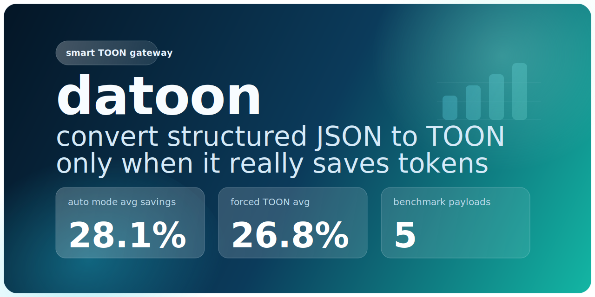

<p align="center">
  
</p>

<h1 align="center">datoon</h1>

<p align="center">
  <strong>smart structured-data→TOON gateway — converts only when it actually saves tokens</strong>
</p>

<p align="center">
  <a href="https://github.com/andrii-su/datoon/actions/workflows/tests.yml"></a>
  <a href="https://github.com/andrii-su/datoon/actions/workflows/pre-commit.yml"></a>
  <a href="https://github.com/andrii-su/datoon/actions/workflows/release.yml"></a>
  <a href="https://pypi.org/project/datoon/"></a>
  <a href="https://img.shields.io/badge/python-3.12%2B-3776AB"></a>
  <a href="./LICENSE"></a>
</p>

<p align="center">
  <a href="#before--after">Before/After</a> •
  <a href="#install">Install</a> •
  <a href="#what-you-get">What You Get</a> •
  <a href="#how-it-works">How It Works</a> •
  <a href="#benchmarks">Benchmarks</a> •
  <a href="./INSTALL.md">Full install guide</a>
</p>

______________________________________________________________________

Raw structured data is often verbose in LLM prompts. [TOON](https://github.com/toon-format/toon) can save tokens — but blind conversion can also make payloads *worse*. `datoon` adds a decision layer: convert when structure and savings justify it, skip when they don't, and always explain why.

Supports **JSON, CSV, JSONL, YAML, XML, Parquet, Avro, ORC, Excel, and Apple Numbers** — auto-detected from file extension.

## Before / After

<table>
<tr>
<td width="50%">

### JSON in the prompt (43 tokens)

```json
{"users":[
  {"id":1,"name":"Ada","role":"admin"},
  {"id":2,"name":"Lin","role":"analyst"},
  {"id":3,"name":"Grace","role":"viewer"}
]}
```

</td>
<td width="50%">

### datoon converts → TOON (24 tokens)

```toon
users[3]{id,name,role}:
  1,Ada,admin
  2,Lin,analyst
  3,Grace,viewer
```

```json
{"decision":"convert","reason":"Estimated savings 44.19% (threshold 15.00%)."}
```

</td>
</tr>
<tr>
<td>

### CSV from a data pipeline (111 tokens as JSON)

```csv
id,name,role
1,Ada,admin
2,Lin,analyst
3,Grace,viewer
```

</td>
<td>

### datoon auto-converts → TOON (24 tokens)

```bash
datoon data.csv --report-stdout
```

Same result. Zero JSON serialization in your code.

</td>
</tr>
<tr>
<td>

### Non-uniform payload (26 tokens)

```json
{"config":{"debug":true},"tags":["a","b"]}
```

</td>
<td>

### datoon skips → keeps JSON

```json
{"decision":"skip","reason":"No uniform object arrays found with at least 3 rows."}
```

No Node.js call. No silent corruption.

</td>
</tr>
</table>

**Same data. Right format. Always explained.**

```
┌──────────────────────────────────────────────────┐
│  PAYLOAD SAVINGS (auto avg)    ████░░░░░░   28%  │
│  PAYLOAD SAVINGS (agent skill) ████████░░   62%  │
│  DECISION ACCURACY             ██████████  100%  │
│  HARMFUL CONVERSIONS BLOCKED   ██████████  100%  │
└──────────────────────────────────────────────────┘
```

> [!IMPORTANT]
> datoon saves **payload tokens** — the structured data portion of your prompt. Token savings depend on payload shape: uniform tabular data converts well; deeply nested or non-uniform structures are skipped. Every decision includes a reason so pipelines can log, debug, and trust the outcome.

## Install

```bash
# core (JSON, CSV, JSONL, XML — no extra deps)
uv add datoon
pip install datoon

# with YAML support
pip install "datoon[yaml]"

# with Excel support
pip install "datoon[excel]"

# with Parquet / ORC / Avro support
pip install "datoon[columnar]"

# with Apple Numbers support
pip install "datoon[numbers]"

# with tiktoken-based token counting
pip install "datoon[tokens]"

# with MCP server
pip install "datoon[mcp]"

# everything
pip install "datoon[all]"
```

Requires Python 3.12+. TOON conversion requires Node.js with `npx` in PATH — analysis and format reading work without it.

For Claude Code plugin, Codex, and MCP config → [**INSTALL.md**](./INSTALL.md).

## What You Get

| | What |
|---|---|
| `datoon` **CLI** | Auto-gate any supported format → TOON from terminal or scripts |
| **Python API** | `convert_json_for_llm()` + `read_tabular()` for any LLM pipeline |
| **MCP Server** | `convert_json`, `convert_text`, `analyze_json` tools for Claude Desktop, Cursor, Windsurf |
| **Claude Code Plugin** | `/datoon` in-session trigger, installs from GitHub in one command |
| **Codex Plugin** | Marketplace plugin — structured-data mode for Codex |

### Supported input formats

| Format | Extension | Extra needed |
|---|---|---|
| JSON | `.json` | — |
| JSONL | `.jsonl`, `.ndjson` | — |
| CSV | `.csv` | — |
| XML | `.xml` | — |
| YAML | `.yaml`, `.yml` | `datoon[yaml]` |
| Excel | `.xlsx`, `.xls` | `datoon[excel]` |
| Parquet | `.parquet` | `datoon[columnar]` |
| Avro | `.avro` | `datoon[columnar]` |
| ORC | `.orc` | `datoon[columnar]` |
| Apple Numbers | `.numbers` | `datoon[numbers]` |

## How It Works

1. **Detect format** — from `--format` flag, file extension, or default to JSON for stdin
1. **Read + normalize** — parse source into list of row dicts; serialize to compact JSON
1. **Analyze structure** — uniform object arrays? acceptable depth? minimum rows?
1. **Gate early** — non-candidates skip before any CLI call; no Node.js overhead
1. **Convert + estimate** — TOON CLI runs, token savings calculated
1. **Gate savings** — below threshold → return JSON; above → return TOON with report

Every path returns a `ConversionReport` with `decision`, `reason`, and token estimates. Pipelines never get silent surprises.

______________________________________________________________________

## Quick Start

**JSON (stdin):**

```bash
echo '{"users":[{"id":1,"name":"Ada"},{"id":2,"name":"Lin"},{"id":3,"name":"Grace"}]}' | datoon --report-stdout
```

**CSV (auto-detected from extension):**

```bash
datoon data.csv --report-stdout
```

**JSONL:**

```bash
datoon data.jsonl -o output.toon
```

**YAML (requires `datoon[yaml]`):**

```bash
datoon data.yaml --report-stdout
```

**Parquet (requires `datoon[columnar]`):**

```bash
datoon data.parquet --report ./report.json
```

**Explicit format override:**

```bash
datoon --format csv < data.csv --report-stdout
```

**Force conversion (bypass gating — for experiments):**

```bash
datoon data.json --force --report-stdout
```

______________________________________________________________________

## Python API

**JSON conversion:**

```python
from datoon import convert_json_for_llm, ConversionConfig, DatoonError

config = ConversionConfig(min_savings_ratio=0.15, max_depth=6, min_uniform_rows=3)

try:
    outcome = convert_json_for_llm(raw_json, config)
except DatoonError as exc:
    raise

# outcome.payload_text  — TOON or original JSON
# outcome.report.decision  — "convert" | "skip"
# outcome.report.reason    — human-readable explanation
send_to_model(outcome.payload_text)
```

**Any format via `read_tabular`:**

```python
import json
from pathlib import Path
from datoon import read_tabular, convert_json_for_llm, ConversionConfig

# text formats: csv, jsonl, yaml, xml
rows = read_tabular("csv", text=csv_string)

# binary formats: excel, parquet, orc, avro, numbers
rows = read_tabular("parquet", path=Path("data.parquet"))

json_text = json.dumps(rows, separators=(",", ":"))
outcome = convert_json_for_llm(json_text, ConversionConfig())
send_to_model(outcome.payload_text)
```

**Structure-only analysis (no Node.js required):**

```python
from datoon.analyzer import analyze_payload
from datoon.models import ConversionConfig

analysis = analyze_payload(parsed_data, ConversionConfig())
print(analysis.is_candidate, analysis.reason)
```

______________________________________________________________________

## MCP Server

<!-- mcp-name: io.github.andrii-su/datoon -->

`datoon` ships an [MCP](https://modelcontextprotocol.io) server with three tools:

| Tool | Description |
|---|---|
| `convert_json` | Full JSON conversion with policy gating |
| `convert_text` | Converts CSV, YAML, XML, or JSONL text with policy gating |
| `analyze_json` | Structure analysis only — no Node.js needed |

**Claude Desktop / Cursor / Windsurf config:**

```json
{
  "mcpServers": {
    "datoon": {
      "command": "uvx",
      "args": ["--from", "datoon[mcp]", "datoon", "mcp"]
    }
  }
}
```

**Run locally:**

```bash
datoon mcp     # or the standalone script: datoon-mcp
```

Listed on the [MCP Registry](https://registry.modelcontextprotocol.io), [Smithery](https://smithery.ai), and [Glama](https://glama.ai). See [MARKETPLACES.md](./MARKETPLACES.md).

______________________________________________________________________

## Claude Code Plugin

Install directly from GitHub:

```bash
claude plugin marketplace add andrii-su/datoon
claude plugin install datoon@datoon
```

Trigger in-session:

```
/datoon
convert this JSON to TOON if it saves tokens
use datoon mode for structured data
```

______________________________________________________________________

## CLI Reference

| Flag | Default | Description |
|---|---|---|
| `--format` | auto | Input format: `json`, `csv`, `jsonl`, `yaml`, `xml`, `excel`, `parquet`, `avro`, `orc`, `numbers` |
| `--force` | `false` | Bypass gating and minimum savings threshold |
| `--min-savings` | `0.15` | Minimum relative token savings required |
| `--max-depth` | `6` | Maximum nesting depth for auto-conversion |
| `--min-uniform-rows` | `3` | Minimum rows in uniform object arrays |
| `--timeout` | `30` | Seconds before TOON CLI call is aborted |
| `--report <path>` | — | Write JSON conversion report to file |
| `--report-stdout` | — | Print JSON conversion report to stderr |
| `-o <path>` | stdout | Output file path |
| `--version` | — | Print version and exit |

Format is auto-detected from file extension. Use `--format` to override or when reading from stdin.

______________________________________________________________________

## Benchmarks

```bash
PYTHONPATH=src python benchmarks/run.py --dry-run
PYTHONPATH=src python benchmarks/run.py
PYTHONPATH=src python benchmarks/run.py --update-readme
```

### Why auto mode outperforms forced conversion

Auto mode avoids low-benefit and high-risk payloads (`orders-nested`, `mixed-non-uniform`) while matching forced TOON's average token count on suitable ones. Every decision comes with a reasoned report.

| Scenario | JSON Baseline | Forced TOON | `datoon` Auto |
|---|---:|---:|---:|
| Average tokens | 77 | 50 | 50 |
| Avg token saved | 0.0% | 26.8% | **28.1%** |
| Decision quality | n/a | Converts all | Converts `3/5`, skips harmful cases |

<!-- BENCHMARK-TABLE-START -->

| Dataset | JSON | TOON (forced) | Raw Saved | Auto | Auto Tokens | Auto Saved |
|---|---:|---:|---:|---|---:|---:|
| users-small | 54 | 40 | 25.9% | convert | 40 | 25.9% |
| events-medium | 219 | 162 | 26.0% | convert | 162 | 26.0% |
| orders-nested | 106 | 116 | -9.4% | skip | 106 | 0.0% |
| mixed-non-uniform | 35 | 47 | -34.3% | skip | 35 | 0.0% |
| metrics-wide | 142 | 103 | 27.5% | convert | 103 | 27.5% |
| **Average** | **111** | **94** | **7.1%** | **3/5 convert** | **89** | **15.9%** |

*Forced conversion succeeded for 5/5 payloads.*

<!-- BENCHMARK-TABLE-END -->

### Format conversion benchmark

Token savings when converting from common structured formats (CSV, JSONL, XML, YAML).
Baseline is the JSON representation of the same data — what an LLM would receive without datoon.

<!-- FORMAT-BENCHMARK-TABLE-START -->

| Dataset | Format | JSON Tokens | TOON (forced) | Auto | Auto Tokens | Auto Saved |
|---|---|---:|---:|---|---:|---:|
| users-csv | csv | 53 | 29 | convert | 29 | 45.3% |
| events-jsonl | jsonl | 194 | 109 | convert | 109 | 43.8% |
| catalog-xml | xml | 96 | 50 | convert | 50 | 47.9% |
| metrics-yaml | yaml | 129 | 61 | convert | 61 | 52.7% |
| **Average** | — | **118** | **62** | **4/4 convert** | **62** | **47.4%** |

*Forced conversion succeeded for 4/4 payloads.*

<!-- FORMAT-BENCHMARK-TABLE-END -->

### Agent skill evaluation

Artifact-based subagent comparison — identical analysis tasks, two modes:

- `with_skill`: agent received the `datoon` skill and followed the conversion workflow.
- `without_skill`: agent used JSON directly, no TOON or `datoon`.

3 payload sizes × 3 iterations = 18 total agent runs. Both modes: 100% correct answers.

| Scenario | Avg JSON Tokens | Avg TOON Tokens | Avg Payload Saved |
|---|---:|---:|---:|
| small | 225 | 118 | 47.6% |
| medium | 2,972 | 1,138 | 61.7% |
| large | 17,757 | 6,673 | 62.4% |

Full report and raw outputs: [`benchmarks/agent_skill_eval/`](benchmarks/agent_skill_eval/). Savings are payload-token estimates, not full end-to-end model-token usage.

______________________________________________________________________

## Development

Contributor workflow: [CONTRIBUTING.md](./CONTRIBUTING.md). Maintainer/agent notes: [CLAUDE.md](./CLAUDE.md).

**Setup:**

```bash
uv sync --extra dev
uvx pre-commit install
```

**Tests:**

```bash
pytest -m "not integration"   # unit only (102 tests)
pytest                        # with integration (requires Node.js + npx)
```

**Skill sync + plugin metadata:**

```bash
python scripts/validate_skill_sync.py
python scripts/validate_plugin_metadata.py
```

______________________________________________________________________

## Links

- [INSTALL.md](./INSTALL.md) — full install matrix, all targets, per-agent detail
- [CONTRIBUTING.md](./CONTRIBUTING.md) — contributor workflow
- [CLAUDE.md](./CLAUDE.md) — maintainer guide for agents
- [CHANGELOG.md](./CHANGELOG.md) — release history
- [SECURITY.md](./SECURITY.md) — vulnerability reporting
- [Live docs](https://andrii-su.github.io/datoon/) — `docs/`
- [Issues](https://github.com/andrii-su/datoon/issues) — bugs, features, questions

______________________________________________________________________

## License

MIT
